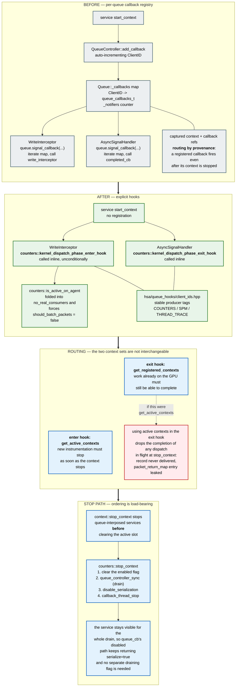

# Queue Callback Registry Removal — Software Architecture

How queue-interposed services are wired into dispatch interception after the per-queue callback
registry is removed, why completion routing and enqueue routing deliberately use different context
sets, and why counter collection's `stop_context` drains the GPU.

Paths are relative to `projects/rocprofiler-sdk/source/lib/rocprofiler-sdk/`. Symbols are named
rather than cited by line number, since line numbers rot faster than the code they point at.

Counter collection, SPM and PC sampling are called through explicit hooks. Thread trace still
registers through `QueueController::add_callback`; it moves to hooks in #11967. This document
describes the mechanism as a whole, using counter collection as the worked example. Section 2.1
lists where the other services depart from it, and SPM and PC sampling each have a page beneath
this one.

## 1. Diagram

## 2. What the migration changes

Before, a service registered a `queue_callbacks_t` (`batch_packets`, `write_interceptor` and
`signal_completion`) with the queue controller: counter collection, SPM and thread trace when a
context started, PC sampling when its configuration finished. The write interceptor and the async
signal handler both walked `Queue::_callbacks` and invoked whatever was registered, and
`Queue::get_notifiers()` counted the registrations so the interceptor could early-out when nothing
was subscribed.

After, the service registers nothing. The write interceptor and the async signal handler call the
service's hooks directly, and each hook decides for itself whether it has work to do by querying the
context list, or for PC sampling its session map.

For counter collection:

| Element | Location |
|---|---|
| `counters::kernel_dispatch_phase_enter_hook` | `counters/queue_hooks.hpp`, `counters/queue_hooks.cpp` |
| `counters::kernel_dispatch_phase_exit_hook` | `counters/queue_hooks.hpp`, `counters/queue_hooks.cpp` |
| `counters::is_any_active`, `counters::is_active_on_agent` | `counters/queue_hooks.hpp`, `counters/queue_hooks.cpp` |
| Context filter shared by all four | `counters/queue_hooks.cpp`, `counter_contexts_filter()` |
| Stable producer tags | `hsa/queue_hooks/client_ids.hpp` |
| Exit hook call site | `hsa/queue.cpp`, in the async signal handler |
| `no_real_consumers` gains `!counters::is_active_on_agent(queue's agent)` | `hsa/queue.cpp` |
| Enter hook call site | `hsa/queue.cpp`, in the write interceptor |
| Batching disabled while counters are active | `hsa/queue.cpp`, `should_batch_packets` |
| Service stop path | `counters/core.cpp`, `stop_context()` |

The hook names describe the dispatch phase they run in: the enter hook runs when a dispatch is being
submitted, the exit hook when its completion signal fires. The activity predicates are neither
phase, so they keep plain names. SPM defines the same four functions in `spm/queue_hooks.{hpp,cpp}`;
PC sampling defines only an exit hook and a configuration predicate in
`pc_sampling/queue_hooks.{hpp,cpp}`. Section 2.1 lists the differences.

`is_active_on_agent()` is the form the per-queue gate uses, and it exists because
`kernel_dispatch_phase_enter_hook()` already skips contexts that do not collect on the dispatch's
agent. Gating on the process-wide `is_any_active()` would drag every queue on every GPU through
interception — and cost it packet batching — on behalf of a context scoped to one GPU, to run a
hook that then filters those dispatches out anyway. `is_any_active()` answers whether the service
is in use at all; only tests call it.

`client_ids.hpp` replaces the registry's auto-incrementing `ClientID` with fixed producer tags, so
the id attached to an instrumentation packet no longer depends on the order in which services
register. The tags are negative, keeping them disjoint from the positive ClientIDs that the
registry still hands out to thread trace. Counter collection and SPM tag every `inst_pkt` entry
they add, and each of their exit hooks returns at once unless some entry carries its tag; which
callback owns a packet is then decided by its address (section 3). PC sampling adds no `inst_pkt`
entry, so no service tags a packet with `PC_SAMPLING_CLIENT_ID`; none tags one with
`THREAD_TRACE_CLIENT_ID` until thread trace migrates. Any tag added here must remain negative and
unique.

### 2.1 How the other services differ

The table compares the four services. The thread trace column describes the registry path that
thread trace still uses.

| | Counter collection | SPM | Thread trace | PC sampling |
|---|---|---|---|---|
| Hooks | enter and exit hooks, `is_any_active`, `is_active_on_agent` | same four | none; one registry entry for every queue (`add_callback(std::nullopt, ...)`), added at the first start and removed by `thread_trace::finalize()` | exit hook and `is_configured_on_agent` only; the marker packet is still added inline by the write interceptor |
| Interceptor gate in `no_real_consumers` | an active context collects on the queue's agent | same | `get_notifiers()` is non-zero on every queue while the entry is registered | a session is configured on the queue's agent, started or not |
| Packet batching | off on the agent while a context is active | same | off on every queue while the entry is registered | unaffected, as before |
| Exit hook iterates | registered contexts | registered contexts | no hook; the registry's `signal_completion` loop calls the tracer's `post_kernel_call` | no contexts; looks up the agent's `PCSAgentSession` |
| Completion finds its owner by | packet address in each callback's `packet_return_map` | same, in SPM's own `packet_return_map` | packet type (`TraceControlAQLPacket`), then the packet's agent | the agent's session, then the dispatch's correlation id |
| Drain in the service stop | `queue_controller_sync()`; a timeout is logged | `queue_controller_sync()`; result discarded | none | none; `stop_service` stops sampling and flushes |
| Serialization reference | taken and dropped only on an `enabled` transition | taken on every start, dropped only on the `enabled` transition | unscoped; taken on every start, dropped on the `enabled` transition | none |
| Start marker in `context::start_context` | yes | yes | yes | no; `start_service` runs after the marker is released |
| Two contexts of this service | conflict at start if their agent sets intersect | same | no conflict rule | a second configuration on the same agent fails with `ROCPROFILER_STATUS_ERROR_SERVICE_ALREADY_CONFIGURED`, as before |

The drain and serialization-reference rows are where SPM and thread trace are weaker than counter
collection, and the start-marker row is where PC sampling is. The SPM and PC sampling pages list
what that leaves open.

## 3. Enqueue and completion use different context sets

This is the central design point, and getting it wrong is a silent data-loss bug rather than a crash.

The registry routed completions by **provenance**: every registered `signal_completion` ran for
every completion and claimed its own packets, regardless of whether the owning context was still
active. The hooks have to reproduce that property without the registry, and they do it by choosing
different context sets for the two phases:

- The **enter hook** iterates `get_active_contexts`. New instrumentation must stop being added as
  soon as the context stops.
- The **exit hook** iterates `get_registered_contexts`. A dispatch already executing on the GPU must
  still be able to deliver its record, even though its context is no longer active.

Routing the exit hook over active contexts instead loses any dispatch that is in flight when its
context is stopped: `completed_cb` never runs, so the record is never delivered to the tool, and the
`packet_return_map` entry is never erased, so the packet never goes back to its config's packet
pool. Because rocprofv3 implements pause/resume as `stop_context`/`start_context`, this shows up as
missing counter records around every pause.

Iterating registered contexts is safe because `completed_cb` self-filters: it resolves ownership by
looking the packet up in its callback's `packet_return_map` and returns early for packets it does
not own. Each context therefore still processes only its own packets, and the guarantee is restored
without reintroducing a registry.

PC sampling needs neither set: its exit hook keys off the queue's agent rather than the context
list, and a configured session is never removed from the global session map.

## 4. The stop path

Two orderings matter, both stated at their call sites in the code.

**`context::stop_context` stops queue-interposed services before clearing the active slot.** Counter
collection, SPM, device thread trace and dispatch thread trace are all stopped ahead of the
`compare_exchange_strong` that nulls the context's active slot. Clearing the slot first opens a
window in which the enter hook sees no active context, so a dispatch is submitted without serializer
packets while the serializer is still enabled. These stops run without the contexts mutex, because
they wait on the GPU. Instead the context's id stays in the registry's stopping set until
`stop_context` returns, and every other lifecycle caller (`start_context`, `stop_context`,
`deactivate_client_contexts`, `deregister_client_contexts`, and the counter collection and SPM
`set_dispatch_agents`) waits in `wait_for_stopping_contexts` until that set is empty. Device
counter collection and PC sampling are stopped after the slot is cleared.

`context::start_context` uses the same set as a start-in-progress marker. It adds the context's id
when it reserves a slot and removes it once dispatch counter collection, SPM and both thread trace
services have started, so no stop, second start or agent-set change can run in between. The marker
is released before device counter collection and PC sampling start, because
`counters::start_agent_ctx()` calls the tool's profile callback synchronously and a tool that called
back into the lifecycle API from there would wait on the marker forever. Section 6 lists what that
leaves open.

**`counters::stop_context` drains the GPU before disabling serialization.** When it is the call that
clears the service's `enabled` flag, it then runs `hsa::queue_controller_sync()`,
`disable_serialization()`, `note_counting_stopped()` and `callback_thread_stop()`, in that order.
SPM drains at the same point, also only when it clears `enabled`, but discards the result; thread
trace does not drain.

### 4.1 Why the drain is kept

Provenance routing and the drain answer different questions, so one does not replace the other.
Provenance routing guarantees that a completion which *arrives* is delivered. The drain bounds
*when completions arrive at all*, which is what the teardown downstream of it depends on: it is what
makes "the callback thread and the `counter_callback_info` objects outlive every in-flight dispatch"
true literally, rather than true by an argument about what happens if they do not.

The supporting facts are worth recording, because they are the reason a missing drain is hard to
notice rather than a reason to omit it:

| Property | Why it holds |
|---|---|
| `counter_callback_info` lifetime | Structural. The context holds them as `std::vector<std::shared_ptr<...>>` on the service, and neither `counters::stop_context` nor `context::stop_context` clears that vector. Since the exit hook iterates *registered* contexts, the context and its callbacks are still reachable. |
| Callback thread does not strand queued work | `consumer_thread_t::exit()` clears `valid` then waits on `exited`, and `consumer_loop` only sets `exited` once `read_ptr == write_ptr`, so the queue drains before the join. Afterwards `consumer_thread_t::add()` takes the self-consume path and runs inline on the caller. Covered by `counters/tests/consumer_test.cpp`, `restart` and `add_after_exit`. |
| Serializer transition with in-flight serialized dispatches | GPU-ordered independently. `profiler_serializer::disable()` records the previous state and pushes an `hsa_barrier` across the queues, and `kernel_completion_signal` reconciles in-flight dispatches against it. |
| No separate "draining" flag is needed | `context::stop_context` calls the service stop path while the context is still in the active list, so throughout the drain the enter hook still reaches `queue_cb`, whose disabled path returns `serialize=true` and keeps the serialized-to-unserialized transition coordinated. This only works because the drain happens before the slot is cleared. |

The per-queue drain is a bound, not a hard barrier: `Queue::sync` waits a single five-second slice
(`drain_slice` in `hsa/queue.cpp`), warns, and returns false if kernels are still active, and
`_active_kernels` counts only submissions that went through the interceptor and still have a
completion handler pending. `hsa::queue_controller_sync()` first waits, with no time limit, for the
queue-interposition completion monitor's in-flight batches (`interposition_sync()`), then syncs
every queue and reports whether all of them drained; `counters::stop_context` logs a timeout and
finishes the stop anyway, pinned by
`counters_queue_hooks.stop_context_completes_when_queue_drain_times_out` in
`counters/tests/queue_hooks_test.cpp`. It is the ordering guarantee for teardown, and provenance
routing in the exit hook is what makes individual completions correct.

Destroying a counter config after a stop does not depend on the drain:
`rocprofiler_destroy_counter_config` only removes the config from the controller's map, and each
in-flight `packet_return_map` entry holds a `shared_ptr` to its config until the completion is
claimed.

## 5. Relationship to kernel replay (#7960)

Kernel replay does not depend on callback removal. A replay pass turns a context off for that pass
without touching global context state: each service's per-dispatch handler folds
`kernel_replay::local_context_override()` into its enabled check (`queue_cb` in
`counters/dispatch_handlers.cpp`, `pre_kernel_call` in `spm/dispatch_handlers.cpp` and in
`thread_trace/core.cpp`), which works the same whether the handler is reached through a hook or
through the registry. PC sampling does not read the override.

The routing rule in section 3 applies to every pass. Replay reuses `process_packet_batch` for each
pass, so every pass creates its own instrumentation packet and its own `packet_return_map` entry,
and each one has to be claimed by the exit hook. The replay loop waits for each pass's completion
handler before it starts the next pass (`replay_drain_or_fatal` in `hsa/queue.cpp`). That wait
gives up after twelve five-second slices and stops the process with a fatal error, so a completion
handler that never finishes ends the run instead of hanging it.

## 6. Known gaps

1. Thread trace still registers through `QueueController::add_callback` until #11967 moves it to
   hooks, so `Queue::_callbacks`, `Queue::get_notifiers()` and `add_callback` itself cannot be
   deleted yet. Device counter collection never used the registry. Once thread trace has migrated,
   nothing calls `add_callback` and the registry can be removed as a follow-up.
2. Each migrated service adds its own term to `no_real_consumers` and to the `should_batch_packets`
   override in `hsa/queue.cpp`, so every migration edits the same expressions. Consolidating the
   predicate into one `needs_interception(queue)` helper would stop them growing per service.
3. `counters::is_active_on_agent()` forces `should_batch_packets = false` for every dispatch on an
   agent a counter context collects on. Scoping the predicate to the agent keeps unrelated GPUs
   batching, but no test isolates the cost on the collecting agent: the perf tests under
   `projects/rocprofiler-sdk/tests/queue-hooks-perf` and `tests/kernel-replay-perf` bound overall
   overhead only.
4. `hsa::queue_controller_sync()` reports whether every queue drained, but only counter collection
   acts on the result. `spm::stop_context` discards it, so an SPM stop whose drain timed out
   releases serialization and returns with no warning beyond the one `Queue::sync()` logs.
5. The start-side marker does not cover device counter collection or PC sampling (section 4). A
   concurrent `rocprofiler_stop_context` can claim the context after the marker is released and run
   its last-phase stops before those services have started. Both stops then do nothing:
   `counters::stop_agent_ctx()` returns early, and `pc_sampling::stop_service()` returns
   `ROCPROFILER_STATUS_ERROR`, which `context::stop_context` ignores. The start then enables the
   service on a context that is no longer active. The next `rocprofiler_start_context` for that
   context activates it again but returns `ROCPROFILER_STATUS_ERROR_SERVICE_ALREADY_CONFIGURED` for
   device counter collection or `ROCPROFILER_STATUS_ERROR` for PC sampling.
