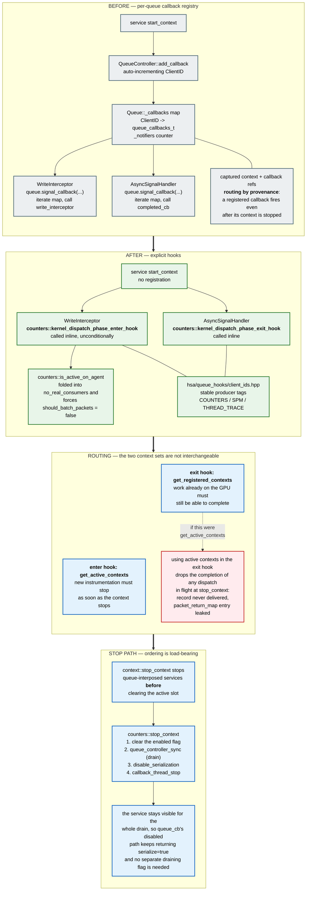

# Queue Callback Registry Removal — Software Architecture

How queue-interposed services are wired into dispatch interception after the per-queue callback
registry is removed, why completion routing and enqueue routing deliberately use different context
sets, and why counter collection's `stop_context` drains the GPU.

Paths are relative to `projects/rocprofiler-sdk/source/`. Symbols are named rather than cited by
line number, since line numbers rot faster than the code they point at.

The migration is one PR per service: counter collection (#11970), SPM (#11968), thread trace
(#11967) and PC sampling (#11969). Each PR carries the shared `hsa/queue_hooks/` pieces it needs, so
they can land in any order. This document describes the mechanism as a whole, and flags
which service each part currently lives on. Section 2.1 lists where the other three services depart
from counter collection; each of those PRs adds a page for its own service beneath this one.

## 1. Diagram

## 2. What the migration changes

Before, a service registered a `queue_callbacks_t` pair with the queue controller when its context
started. The write interceptor and the async signal handler both walked `Queue::_callbacks` and
invoked whatever was registered, and `Queue::get_notifiers()` counted the registrations so the
interceptor could early-out when nothing was subscribed.

After, the service registers nothing. The write interceptor and the async signal handler call the
service's hooks directly, and each hook decides for itself whether it has work to do by querying the
context list.

For counter collection:

| Element | Location |
|---|---|
| `counters::kernel_dispatch_phase_enter_hook` | `counters/queue_hooks.hpp`, `counters/queue_hooks.cpp` |
| `counters::kernel_dispatch_phase_exit_hook` | `counters/queue_hooks.hpp`, `counters/queue_hooks.cpp` |
| `counters::is_any_active`, `counters::is_active_on_agent` | `counters/queue_hooks.hpp`, `counters/queue_hooks.cpp` |
| Context filter shared by all three | `counters/queue_hooks.cpp`, `counter_contexts_filter()` |
| Stable producer tags | `hsa/queue_hooks/client_ids.hpp` |
| Exit hook call site | `hsa/queue.cpp`, in the async signal handler |
| `no_real_consumers` gains `!counters::is_active_on_agent(queue's agent)` | `hsa/queue.cpp` |
| Enter hook call site | `hsa/queue.cpp`, in the write interceptor |
| Batching disabled while counters are active | `hsa/queue.cpp`, `should_batch_packets` |
| Service stop path | `counters/core.cpp`, `stop_context()` |

The hook names describe the dispatch phase they run in: the enter hook runs when a dispatch is being
submitted, the exit hook when its completion signal fires. The activity predicates are neither
phase, so they keep plain names. SPM and thread trace define the same four functions in their own
`queue_hooks.{hpp,cpp}`; PC sampling defines only an exit hook and a configuration predicate.
Section 2.1 lists the differences.

`is_active_on_agent()` is the form the per-queue gate uses, and it exists because
`kernel_dispatch_phase_enter_hook()` already skips contexts that do not collect on the dispatch's
agent. Gating on the process-wide `is_any_active()` would drag every queue on every GPU through
interception — and cost it packet batching — on behalf of a context scoped to one GPU, to run a
hook that then filters those dispatches out anyway. `is_any_active()` remains for callers that
genuinely want "is this service in use at all".

`client_ids.hpp` replaces the registry's auto-incrementing `ClientID` with fixed producer tags, so
the id attached to an instrumentation packet no longer depends on the order in which services
register. The tags are negative, keeping them disjoint from the positive ClientIDs still used by
services that have not migrated yet. Each migrated service identifies its own packets by its tag,
so any tag added here must remain negative and unique.

### 2.1 How the other services differ

Each PR migrates only its own service; on every branch the other three still register through
`QueueController::add_callback`. The table compares the four PR heads.

| | Counter collection (#11970) | SPM (#11968) | Thread trace (#11967) | PC sampling (#11969) |
|---|---|---|---|---|
| Hooks | enter and exit hooks, `is_any_active`, `is_active_on_agent` | same four | same four | exit hook and `is_configured_on_agent` only; the marker packet is still added inline by the write interceptor |
| Interceptor gate in `no_real_consumers` | an active context collects on the queue's agent | same | same | a session is configured on the queue's agent, started or not |
| Packet batching | off on the agent while a context is active | same | same | unaffected, as before |
| Exit hook iterates | registered contexts | registered contexts | registered contexts | no contexts; looks up the agent's `PCSAgentSession` |
| Completion finds its owner by | packet address in each callback's `packet_return_map` | same, in SPM's own `packet_return_map` | `THREAD_TRACE_CLIENT_ID`, then the tracer id stamped on the `TraceControlAQLPacket` | the agent's session, then the dispatch's correlation id |
| Drain in the service stop | `queue_controller_sync()`; a timeout is logged | `queue_controller_sync()`; result discarded | none | none; `stop_service` stops sampling and flushes |
| Serialization reference | taken and dropped only on an `enabled` transition | taken on every start, dropped on every stop | taken on every start, dropped on the `enabled` transition | none |
| Start marker in `context::start_context` | yes | no | no | no |
| Two contexts of this service | conflict at start if their agent sets intersect; develop rejected any second one | conflict at start if their agent sets intersect; develop had no rule | conflict at start if their configured agents intersect; develop had no rule | a second configuration on the same agent fails with `ROCPROFILER_STATUS_ERROR_SERVICE_ALREADY_CONFIGURED`, as before |
| Shared code carried | `client_ids.hpp`, per-agent serialization refcount, context registry rework | same | same | none |

The drain, serialization-reference and start-marker rows are where the siblings are weaker than
counter collection; each sibling's page lists what that leaves open at its head.

## 3. Enqueue and completion use different context sets

This is the central design point, and getting it wrong is a silent data-loss bug rather than a crash.

The registry routed completions by **provenance**: the callback pair captured at enqueue time was
invoked when the packet completed, regardless of whether the owning context was still active. The
hooks have to reproduce that property without the registry, and they do it by choosing different
context sets for the two phases:

- The **enter hook** iterates `get_active_contexts`. New instrumentation must stop being added as
  soon as the context stops.
- The **exit hook** iterates `get_registered_contexts`. A dispatch already executing on the GPU must
  still be able to deliver its record, even though its context is no longer active.

Routing the exit hook over active contexts instead loses any dispatch that is in flight when its
context is stopped: `completed_cb` never runs, so the record is never delivered to the tool, and the
`packet_return_map` entry is never erased, leaking the AQL packet and its profile allocation. Because
pause/resume is implemented as `stop_context`/`start_context`, this shows up as missing counter
records around every pause.

Iterating registered contexts is safe because `completed_cb` self-filters: it resolves ownership by
looking the packet up in its own context's `packet_return_map` and returns early for packets it does
not own. Each context therefore still processes only its own packets, and the guarantee is restored
without reintroducing a registry.

PC sampling (#11969) needs neither set: its exit hook keys off the queue's agent rather than the
context list, and a configured session is never removed from the global session map.

## 4. The stop path

Two orderings matter, both stated at their call sites in the code.

**`context::stop_context` stops queue-interposed services before clearing the active slot.** Counter
collection, SPM, device thread trace and dispatch thread trace are all stopped ahead of the
`compare_exchange_strong` that nulls the context's active slot. Clearing the slot first opens a
window in which the enter hook sees no active context, so a dispatch is submitted without serializer
packets while the serializer is still enabled. This ordering is part of the context registry rework
that #11970, #11968 and #11967 each carry; develop, and #11969, still clear the slot first while
holding the contexts mutex.

**`counters::stop_context` drains the GPU before disabling serialization.** The order is: clear the
service's `enabled` flag, `hsa::queue_controller_sync()`, `disable_serialization()`, then
`callback_thread_stop()`. SPM (#11968) drains at the same point; thread trace (#11967) does not
drain.

### 4.1 Why the drain is kept

Provenance routing and the drain answer different questions, so one does not replace the other.
Provenance routing guarantees that a completion which *arrives* is delivered. The drain bounds
*when completions arrive at all*, which is what the teardown downstream of it depends on: it is what
makes "the callback thread and the `counter_callback_info` objects outlive every in-flight dispatch"
true literally, rather than true by an argument about what happens if they do not.

The supporting facts are worth recording, because they are the reason a missing drain is hard to
notice rather than a reason to omit it:

| Property | Why it holds |
|---|---|
| `counter_callback_info` lifetime | Structural. The context holds them as `std::vector<std::shared_ptr<...>>` on the service, and neither `counters::stop_context` nor `context::stop_context` clears that vector. Since the exit hook iterates *registered* contexts, the context and its callbacks are still reachable. |
| Callback thread does not strand queued work | `consumer_thread_t::exit()` clears `valid` then waits on `exited`, and `consumer_loop` only sets `exited` once `read_ptr == write_ptr`, so the queue drains before the join. Afterwards `consumer_thread_t::add()` takes the self-consume path and runs inline on the caller. Covered by `counters/tests/consumer_test.cpp`, `restart`. |
| Serializer transition with in-flight serialized dispatches | GPU-ordered independently. `profiler_serializer::disable()` records the previous state and pushes an `hsa_barrier` across the queues, and `kernel_completion_signal` reconciles in-flight dispatches against it. |
| No separate "draining" flag is needed | `context::stop_context` calls the service stop path while the context is still in the active list, so throughout the drain the enter hook still reaches `queue_cb`, whose disabled path returns `serialize=true` and keeps the serialized-to-unserialized transition coordinated. This only works because the drain happens before the slot is cleared. |

The drain is a bound, not a hard barrier: `Queue::sync` waits a single five-second slice
(`drain_slice` in `hsa/queue.cpp`), warns, and returns false if kernels are still active, and
`_active_kernels` counts intercepted dispatches only. `hsa::queue_controller_sync()` syncs every
queue and reports whether all of them drained; `counters::stop_context` logs a timeout and finishes
the stop anyway, pinned by `counters_queue_hooks.stop_context_completes_when_queue_drain_times_out`
in `counters/tests/queue_hooks_test.cpp`. It is the ordering guarantee for teardown, and provenance
routing in the exit hook is what makes individual completions correct.

One hazard is not covered by either mechanism: the drain incidentally protects the sequence "stop the
context, then destroy the counter config". If a tool does that, the guard belongs at the destroy
path as a drain or a refcount, since that is where the lifetime actually ends.

## 5. Relationship to kernel replay (#8622)

Callback removal is a soft prerequisite for kernel replay, not a blocker, and the two can land in
either order.

It helps because with the registry there is no explicit "if this context is active" block in the
write interceptor — the decision is hidden inside the registered callbacks, so disabling a service
for a single replay pass means mutating the callback structure. Once the hooks are inline, the
interceptor has an explicit conditional on context activity, which is a much easier place to express
that a context is active globally but inactive for this pass.

The routing rule in section 3 matters more under replay than without it. Replay runs N passes per
dispatch and reuses `process_packet_batch` for each pass, so every pass creates its own
instrumentation packet and its own `packet_return_map` entry. A dropped completion is one lost record
without replay; under replay it is N leaked packets per dispatch plus silently missing counter
groups. The replay loop also waits on its `pass_done` barrier with no timeout, so a stall on the
completion path becomes an application hang rather than data loss.

## 6. Known gaps

1. Until SPM (#11968), thread trace (#11967) and PC sampling (#11969) land, each still registers
   through `QueueController::add_callback`, so `Queue::_callbacks`, `Queue::get_notifiers()` and
   `add_callback` itself cannot be deleted yet. Device counter collection never used the registry.
   Once all four migrations are in, nothing calls `add_callback` and the registry can be removed as
   a follow-up.
2. Several in-flight PRs edit the same `no_real_consumers` expression in `hsa/queue.cpp`.
   Consolidating the predicate into one `needs_interception(queue)` helper would remove the
   recurring conflict.
3. `counters::is_active_on_agent()` forces `should_batch_packets = false` for every dispatch on an
   agent a counter context collects on. Scoping the predicate to the agent keeps unrelated GPUs
   batching, but the cost on the collecting agent, combined with kernel replay's own gate, has not
   been measured.
4. The start-side marker in `context::start_context` and the boolean result of
   `hsa::queue_controller_sync()` exist only on this branch. The SPM and thread trace branches
   carry the same registry rework without them. The marker is service-agnostic, so it would close
   their start windows too once they share a branch with this change; until then those windows are
   open, as their pages state.
